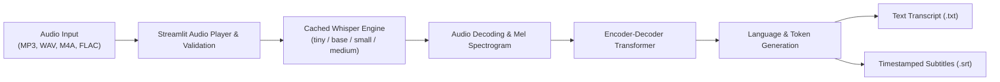

# Audio Whisperizer — Local Speech-to-Text & Subtitle Engine

[](https://www.python.org/)
[](https://streamlit.io/)
[](https://github.com/openai/whisper)
[](https://pytorch.org/)
[]()
[](LICENSE)

**Audio Whisperizer** is a private, offline Automatic Speech Recognition (ASR) desktop web application built with **Streamlit** and **OpenAI's Whisper** foundation model. It enables fast transcription and translation directly on your local hardware—ensuring complete data privacy for proprietary recordings, interviews, and confidential meetings—with automated SubRip Subtitle (`.srt`) and plain text (`.txt`) export.

---

## Architecture & Processing Pipeline



---

## Key Features

* **100% Local & Confidential:** Zero audio data leaves your machine. Perfect for sensitive interviews, legal depositions, and proprietary research.
* **Selectable Model Weights:** Choose between `tiny`, `base`, `small`, and `medium` models depending on available CPU/GPU hardware and required accuracy.
* **Multi-Format Ingestion:** Native support for `.mp3`, `.wav`, `.m4a`, `.ogg`, and `.flac`.
* **Automated Subtitle Generation:** Calculates millisecond-accurate timecodes formatted for SubRip (`.srt`) video workflows.
* **Resource Optimization:** Utilizes Streamlit's `@st.cache_resource` to keep model weights loaded in memory, eliminating redundant disk I/O between transcriptions.
* **Performance Telemetry:** Displays elapsed processing duration, detected audio language, and word count metrics in real time.

---

## Repository Structure

```
Audio-Whisperizer/
├── app.py               # Feature-rich Streamlit web application
├── main.py              # Lightweight minimalist CLI/Streamlit entrypoint
├── requirements.txt     # Pinned Python package dependencies
├── audio_files/         # Working directory for local audio files (gitignored)
├── .gitignore           # Ignores binaries, caches, and large audio tracks
├── LICENSE              # MIT Open Source License
└── README.md            # Project overview & documentation
```

---

## Getting Started

### 1. Prerequisites

Make sure you have **FFmpeg** installed (required by Whisper for audio decoding):

* **macOS (via Homebrew):**
  ```bash
  brew install ffmpeg
  ```
* **Ubuntu / Debian:**
  ```bash
  sudo apt update && sudo apt install -y ffmpeg
  ```
* **Windows (via Chocolatey or winget):**
  ```bash
  winget install Gyan.FFmpeg
  ```

### 2. Installation

1. Clone this repository:
   ```bash
   git clone https://github.com/<your-username>/audio-whisperizer.git
   cd audio-whisperizer
   ```

2. Create and activate a virtual environment:
   ```bash
   python3 -m venv venv
   source venv/bin/activate    # On Windows: venv\Scripts\activate
   ```

3. Install project dependencies:
   ```bash
   pip install -r requirements.txt
   ```

### 3. Running the Application

Launch the Streamlit interface:
```bash
streamlit run app.py
```

The application will automatically open in your default browser at `http://localhost:8501`.

---

## Engineering Considerations

* **Compute Acceleration:** Automatically utilizes Apple Silicon Metal Performance Shaders (MPS) or NVIDIA CUDA when available, gracefully falling back to multi-threaded CPU inference.
* **Secure Scratch Storage:** Audio buffers are handled using atomic temporary files with guaranteed lifecycle cleanup in `finally` blocks, preventing disk leakage.

---

## Author & License

Developed by **Osakwe**.  
Released under the [MIT License](LICENSE).
